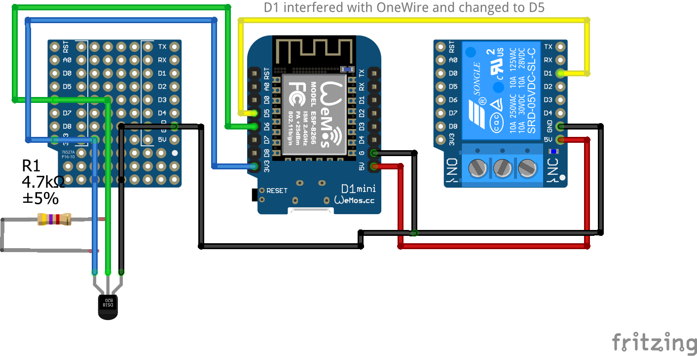

# IOT Thermometer #
## Specification ##

Device must be small and regulate cooling system temperature of absorbtion camping fridge.

Hardware:

* WEMOS D1
* Relay shield
* D18B20 Thermometer
* protoboard

Firmware:

* OTA
* Soft-AP
* On-Off regulator with histeresis
* Temperature display at specific IP adress

Power Consumption

WiFi is turned off after 15 minutes of working to refuce power consumption.

Power used in WiFi on mode is 0.66W .

Power used in WiFi off mode is 0.25W .
